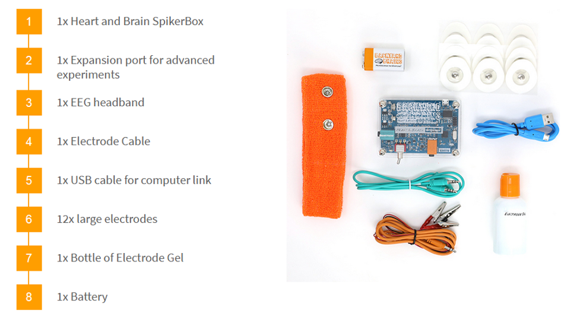
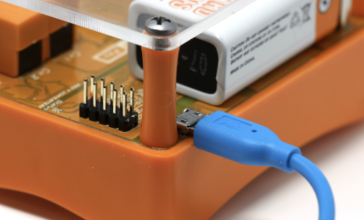
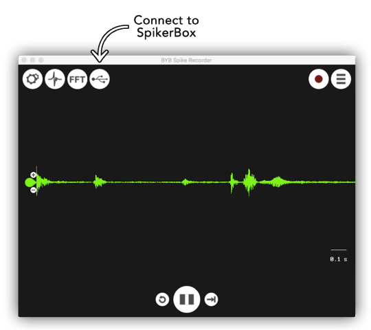
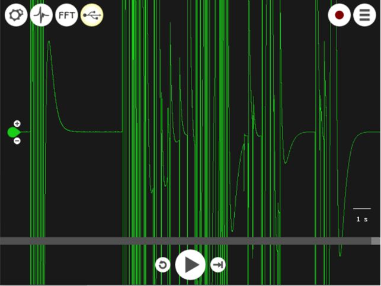
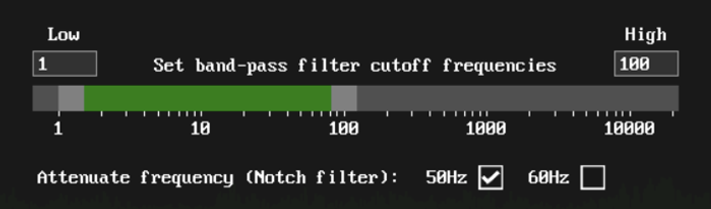

# Setting Up

Check out your sick kit!:

This week, you will learn how this equipment can be used to measure signals from your brain and body.

## Installing the _BYB Spike Recorder_ Software

The _BYB Spike Recorder_ app allows you to take input data from this equipment into a computer.

### Lab Computer

All lab computers come with the _BYB Spike Recorder_ software installed, so you're all good.

### Personal Laptop

You can [download the _BYB Spike Recorder_ software](https://backyardbrains.com/products/spikerecorder) for use on your laptop, for Windows, Mac, and Linux, and even [iOS](https://apps.apple.com/us/app/spike-recorder/id972173310?mt=12) and [Android](https://play.google.com/store/apps/details?id=com.backyardbrains&hl=en&gl=US).

Detailed information is provided by the developers [here], but we'll walk you through the basics in this tutorial.

## Measuring Streaming Data Using the _BYB Spike Recorder_

So you have your box and a computer with the _BYB Spike Recorder_ software installed.
Let's get measuring!

### Your first connection

#### Connecting the _SpikerBox_ to your computer:
1. Connect your _SpikerBox_ to your computer using the blue USB cable.
2. Connect the orange electrode cable (with 3 alligator clips) to the _SpikerBox_.
3. Ensure that a functioning battery is in, flick the on switch, and verify that a green light appears.

#### Getting a Signal

Open the _BYB Spike Recorder_ software on your computer.
By default, the software will be taking input from your microphone, but we want to instead take our input from the _SpikerBox_.

If the connection is successful, you should see a USB button, which you should click to set the input to the _SpikerBox_:

_Note_: if this button doesn't appear to connect the _SpikerBox_, try turning off Bluetooth and repeating the steps above.

Verify that you are receiving _SpikerBox_ input by tapping a finger one of the orange _SpikerBox_ cables:

#### Frequency-based filtering

The _BYB Spike Recorder_ includes in-built settings for frequency-based filtering of the input signal, which you can access by clicking the _Config_ button (top-left).
For example, this can help to reduce noise that is isolated to specific frequency ranges, and therefore boost useful signal.

A good starting point is to filter out frequencies below 1Hz and above 100Hz.
You should also apply a Notch filter around 50Hz.

_Do you know why filtering out 50Hz oscillations from our signal might be useful?_

### Using the _SpikerBox_ with _BYB Spike Recorder_

The battery drains easily---please don't forget to switch off the unit when you're done.
